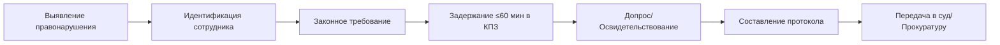

# 🪖 San Andreas National Guard & State Legal Reference
> 📋 Полная памятка для сотрудников SANG и государственных структур Majestic RP  
> 🗂️ Версия: 1.0 | 📅 Обновлено: Февраль 2026  
> 🎯 Предназначение: Быстрый доступ к уставам, кодексам и процедурам

---

## 📑 Оглавление

<details>
<summary>🔽 Развернуть навигацию</summary>

1. [🔰 Быстрый доступ](#-быстрый-доступ)
2. [🏛️ Конституция штата San Andreas](#-конституция-штата-san-andreas)
3. [⚔️ Устав SANG](#-устав-san-andreas-national-guard)
4. [🪖 Строевой устав](#-строевой-устав)
5. [🛡️ Устав караульной службы](#-устав-караульной-службы)
6. [⚖️ Уголовный кодекс](#-уголовный-кодекс-выжимка)
7. [⚙️ Процессуальный кодекс](#-процессуальный-кодекс-выжимка)
8. [💼 Трудовой кодекс](#-трудовой-кодекс-выжимка)
9. [🤝 Кодекс этики](#-кодекс-этики-и-служебного-поведения)
10. [📻 Радиокоды и процедуры](#-радиокоды-и-процедуры)
11. [🗓️ Расписания и графики](#-расписания-и-графики)
12. [📋 Чек-листы](#-чек-листы)

</details>

---

## 🔰 Быстрый доступ

```bash
# 🚨 Экстренные команды
/break_break_break    # Приоритет в эфире (угроза жизни)
/emergency_traffic    # Режим "только экстренные"

# 📡 Основные тен-коды
10-1   # Занял пост          | 10-2   # Покинул пост
10-4   # Принято             | 10-7   # AFK (до 15 мин)
10-20  # Запрос локации      | 10-21  # Задержание
10-33  # Проникновение на базу | 10-70  # Требуется подкрепление
10-99  # Ситуация урегулирована | MAYDAY # Экстренная посадка

# 🎯 Code Mark (приоритеты)
Code 1  # Огонь по сотруднику | Code 3  # Приоритет с сиренами
Code 4  # Ситуация урегулирована | Code BROWN # Террористический акт
```

---

## 🏛️ Конституция штата San Andreas

### 🔹 Структура документа
| Раздел | Тема | Ключевые статьи для SANG |
|--------|------|-------------------------|
| 1 | Основы конституционного строя | Суверенитет, разделение властей |
| 2 | Декларация прав | Права граждан, ограничения |
| 4 | Законодательная власть | Полномочия Конгресса |
| 5 | Исполнительная власть | **Ст. 60**: МинОбороны — прямое руководство SANG |
| 6 | Судебная власть | Независимость судов |
| 11 | Импичмент | **Ст. 102**: Кого можно impeach |

### 🔹 Статья 60 (Ключевая для SANG)
> Министерство обороны осуществляет прямой контроль и надзор за San Andreas National Guard. Министр Обороны и его Заместитель являются прямым начальством SANG.

---

## ⚔️ Устав San Andreas National Guard

### 🔹 Табель званий
```
01 Private              06 Warrant Officer        11 Lieutenant Colonel
02 Private First Class  07 Chief Warrant Officer  12 Colonel
03 Corporal             08 Lieutenant             13 General-Major
04 Sergeant             09 Captain                14 General-Lieutenant
05 Sergeant Major       10 Major*                 15 General
```
> *Максимальное звание в подразделении — Major (10)

### 🔹 Требования к кандидатам
```yaml
Возраст: от 21 года
Документы:
  - ID-карта штата
  - Медицинские справки
  - Лицензия Drive D
  - Лицензия на оружие
Внешний вид:
  - Короткая опрятная причёска (мужчины)
  - Естественный цвет волос
  - Без тату на голове/шее/кистях
  - Без грима и неестественного макияжа
Запрещено:
  - Судимость или нахождение в розыске
  - Наличие в чёрном списке SANG
```

### 🔹 Рабочее время
| День | Время (МСК) |
|------|-------------|
| Пн–Пт | 09:00 – 00:00 |
| Сб–Вс | 11:00 – 00:00 |

### 🔹 Обязательное снаряжение
- [ ] Бронежилет
- [ ] Бодикамера
- [ ] Табельное оружие
- [ ] Военная рация
- [ ] Наручники
- [ ] Discord (специальная связь)

### 🔹 Подразделения SANG
| Аббревиатура | Полное название | Назначение |
|--------------|----------------|------------|
| **MA** | Military Academy | Обучение и подготовка кадров |
| **FSU** | Fort Security Unit | Охрана территории Форта |
| **MP** | Military Police | Военная полиция, патрулирование |
| **DF** | Delta Force | Спецоперации, антитеррор |
| **USAF** | United States Air Force | Боевая авиация, контроль ВЗ |
| **КМБ** | Курс Молодого Бойца | Начальная подготовка новобранцев |

### 🔹 Запрещено военнослужащим (выжимка)
```diff
+ Разрешено:
  - Носить форму в пределах Форта
  - Использовать служебный транспорт по назначению
  - Применять оружие при угрозе жизни

- Запрещено:
  - Передвигаться по штату в военной форме
  - Проезжать КПП без предъявления удостоверения
  - Хранить/употреблять алкоголь на территории Форта
  - Иметь связи с криминальными организациями
  - Превышать полномочия или открывать огонь без причины
  - Разглашать информацию о поставках оборудования SANG
```

---

## 🪖 Строевой устав

### 🔹 Основные термины
| Термин | Определение |
|--------|-------------|
| **Строй** | Установленное размещение военнослужащих для совместных действий |
| **Фронт** | Сторона, в которую обращены лицом военнослужащие |
| **Фланг** | Правая или левая оконечность строя |
| **Колонна** | Построение в затылок друг другу |
| **Шеренга** | Построение в одну линию |
| **Направляющий** | Головной, по которому сообразуют движение |

### 🔹 Строевые команды
```bash
"Смирно!"     # Стоять строго, слушать, вопросы запрещены
"Вольно!"     # Свободное положение в строю, можно говорить
"Разойтись!"  # Можно покинуть строй
"Становись!"  # Занять места, прекратить разговоры и движение
```

### 🔹 Обязанности в строю
```yaml
Командир:
  - Указать место/время построения (за 10 мин)
  - Проверить внешний вид и снаряжение
  - Поддерживать дисциплину

Военнослужащий:
  - Быть сытым, проверить снаряжение
  - На фамилию: "Я, сэр!/мэм!"
  - На приказ: "Да, сэр!/мэм!"
  - Заполнять строй справа налево
```

### 🔹 В строю запрещено
```diff
❌ Есть, пить, курить
❌ Разговаривать без разрешения
❌ Использовать телефон/рацию без команды
❌ Самовольно открывать огонь
❌ Находиться в несоответствующей форме
```

---

## 🛡️ Устав караульной службы

### 🔹 Контрольно-пропускные пункты (КПП)
| КПП | Назначение | Кто может проезжать | Караульных |
|-----|------------|-------------------|------------|
| **КПП-1** | Дополнительный въезд | Генералитет, конвои, патрули (3+), высшее руководство | 1–4 |
| **КПП-2** | Основной въезд | Все военнослужащие, патрули, госструктуры по запросу | 1–4 |
| **КПП-3** | Парковка спец. техники | Генералитет, конвои, патрули | 1–4 |
| **КПП-4** | Хранилище ГСМ | Генералитет, конвои, патрули | 1–4 |
| **КПП-5** | Въезд на аэродром | Генералитет, конвои, патрули, USAF | 1–4 |

### 🔹 Обязанности караульного
```yaml
Перед заступлением:
  - Проверить полное обмундирование:
    • 2 бронежилета
    • 1 ИРП (индивидуальный рацион)
    • Автомат + ≥240 патронов
  - Заступить с докладом в рацию

В ходе несения службы:
  - Докладывать статус каждые 20 минут
  - Проверять багажник и удостоверение у всех въезжающих
  - Исключение: генералитет SANG

Форма доклада:
  > [Дежурный КПП-1/2/3/4/5] 10-1 Состояние стабильное
```

### 🔹 На посту запрещено
```diff
❌ Вести разговоры с гражданскими (кроме проверки)
❌ Находиться без полного обмундирования
❌ Пропускать лиц без обоснованной причины
❌ Танцевать, слушать музыку, курить, использовать телефон
```

---

## ⚖️ Уголовный кодекс (выжимка)

> ⚠️ Полная версия: [forum.majestic-rp.ru/threads/ugolovnyi-kodeks.2000854/](https://forum.majestic-rp.ru/threads/ugolovnyi-kodeks.2000854/)

### 🔹 Классификация преступлений
```yaml
F (Felony) - Тяжкие преступления:
  - Убийство, терроризм, побег из-под стражи
  - Наказание: лишение свободы, крупный штраф

M (Misdemeanor) - Проступки:
  - Мелкое хулиганство, неповиновение
  - Наказание: штраф, общественные работы

A (Administrative) - Административные:
  - Нарушение ПДД, мелкое нарушение порядка
  - Наказание: штраф, предупреждение
```

### 🔹 Ключевые статьи для SANG
| Статья | Нарушение | Звёзды | Залог | Наказание |
|---------|-----------|--------|-------|-----------|
| **11.1** | Нападение на сотрудника | 3* | $75,000 | До 30 мес. |
| **11.2** | Сопротивление при задержании | 2* | $50,000 | До 20 мес. |
| **12.1** | Незаконное хранение оружия | 2* | $50,000 | До 20 мес. |
| **14.1** | Угон транспортного средства | 2* | $50,000 | До 20 мес. |
| **17.11** | Побег при задержании | 3* | $75,000 | До 30 мес. |
| **18.1** | Неисполнение приказа (воен.) | 3* | $75,000 | До 30 мес. |
| **18.3** | Нарушение боевого дежурства | 5* | Запрещён | До 50 мес. |

### 🔹 Процедура задержания


---

## ⚙️ Процессуальный кодекс (выжимка)

### 🔹 Основные термины
| Термин | Определение |
|--------|-------------|
| **Задержание** | Кратковременное лишение свободы (≤60 мин в КПЗ), не является наказанием |
| **Законное требование** | Чёткое, обоснованное требование уполномоченного лица |
| **Допрос** | Получение информации от допрашиваемого в рамках следствия |
| **Освидетельствование** | Установление особых примет, следов преступления, повреждений |
| **Визуальный осмотр** | Проверка содержимого ТС при открытом багажнике (не обыск!) |

### 🔹 Права задержанного
```yaml
Имеет право:
  ✅ На идентификацию сотрудника перед требованием
  ✅ На объяснение причины задержания
  ✅ На уведомление о правах (аналог Miranda)
  ✅ На юридическую помощь
  ✅ На медицинскую помощь при необходимости

Не имеет права:
  ❌ Сопротивляться законному задержанию
  ❌ Оскорблять сотрудника
  ❌ Уничтожать доказательства
```

### 🔹 Процессуальные паузы (не учитываются в 60 мин)
```bash
• Ожидание перевода/конвоя
• Ожидание судебного решения
• Ожидание медицинской помощи
• Перерывы на отдых/питание (по согласованию)
```

---

## 💼 Трудовой кодекс (выжимка)

### 🔹 Права и обязанности работника
```yaml
Права:
  • На труд, отдых, оплату, защиту прав
  • На нормированный рабочий день
  • На безопасные условия труда

Обязанности:
  • Соблюдать трудовую дисциплину
  • Выполнять поручения руководства
  • Бережно относиться к имуществу
  • Соблюдать устав и законы штата
```

### 🔹 Дисциплинарные взыскания (по возрастанию)
1. Профилактическая беседа
2. Выговор
3. Лишение премии
4. Понижение в должности
5. Переаттестация
6. Отстранение (до 72 часов)
7. Увольнение (+ возможное уголовное преследование)
8. Чёрный список организации

> ⚠️ **3 выговора = автоматическое увольнение**

### 🔹 Основания для увольнения (инициатива работодателя)
```diff
+ Допустимо:
  • Нарушение устава организации
  • Неоднократное неисполнение обязанностей
  • Прогул (≥7 дней отсутствия)
  • Появление в состоянии опьянения
  • Разжигание конфликтов

- Недопустимо:
  • Увольнение за одно незначительное нарушение
  • Увольнение без письменного предупреждения
  • Увольнение во время расследования без решения суда
```

### 🔹 Курс Молодого Бойца (КМБ)
```yaml
Статус: Временные трудовые отношения
Оплата: Базовая ставка военнослужащего
Запрещено:
  - Премии и поощрительные выплаты
  - Переводы/повышения (кроме по КМБ)
  - Отпуск (кроме экстренных случаев)

По завершении:
  ✅ Право заключить контракт с SANG
  ✅ Сертификат о прохождении военной службы
  ✅ Сертификат даёт право поступления в силовые структуры
```

---

## 🤝 Кодекс этики и служебного поведения

### 🔹 Основные принципы (Ст. 11)
```yaml
Госслужащий обязан:
  • Исполнять обязанности добросовестно и профессионально
  • Защищать права и свободы граждан
  • Действовать в пределах полномочий
  • Быть независимым от личных интересов
  • Уведомлять о попытках склонения к коррупции
  • Соблюдать беспристрастность и профессиональную этику
  • Проявлять корректность и уважение к гражданам
```

### 🔹 Дресс-код (Раздел 4)
```yaml
✅ Разрешено:
  Мужчины: Строгий костюм, брюки, классические джинсы, 
           рубашка, пиджак, поло, однотонная обувь, часы
  Женщины: Строгий костюм, классические джинсы, 
           платья/юбки ниже колен, туфли, дневной макияж

❌ Запрещено:
  • Спортивная/пляжная одежда
  • Одежда с логотипами брендов (кроме ремней)
  • Шорты, мини-юбки, глубокие декольте
  • Неестественный цвет волос, яркие тату на открытых частях
  • Головные уборы (кроме установленных уставом)
  • Яркий макияж, цветные линзы

❗ Исключения:
  • Сотрудники Министерства культуры и Weazel News
  • Сотрудники при исполнении спец. обязанностей
```

### 🔹 Ответственность за нарушения этики
| Нарушение | Штраф | Дополнительно |
|-----------|-------|--------------|
| Оскорбление гражданина | До $25,000 | Дисциплинарное взыскание |
| Оскорбление гос. сотрудника | До $30,000 | Дисциплинарное взыскание |
| Создание конфликтной ситуации | До $30,000 | Дисциплинарное взыскание |
| Злоупотребление властью | До $40,000 | Дисциплинарное взыскание |
| Нарушение дресс-кода | До $30,000 | Дисциплинарное взыскание |

> 💡 Штраф должен быть оплачен в течение **24 часов**. Неуплата = увольнение.

---

## 📻 Радиокоды и процедуры

### 🔹 Постовые коды
```bash
10-1   # Занял пост
10-2   # Покинул пост
10-30  # Состояние стабильное
10-32  # Состояние критическое
10-33  # Проникновение на базу
10-7   # AFK (не более 15 минут)
```

### 🔹 Патрульные коды
```bash
# Наземный патруль
4-1    # Начал патруль
4-2    # Закончил патруль
4-4    # Патрулирую

# Пеший патруль
5-1    # Начал патруль
5-2    # Закончил патруль
5-4    # Патрулирую
```

### 🔹 Оперативные коды
```bash
10-0   # Отмена/Отбой
10-3   # Радиомолчание
10-4   # Сообщение принято
10-5   # Повторить сообщение
10-6   # Сообщение не принято
10-9   # Состояние критическое
10-20  # Запрос локации
10-21  # Провожу задержание/арест
10-22  # Выехал на место инцидента
10-32  # Зрительный контакт с вооружёнными
10-35  # Запрос на посадку/взлет
10-36  # Запрос на движение в воздушном пространстве
10-38  # Запрос на посадку/взлет принят
10-39  # Запрос на посадку/взлет отклонен
10-46  # Произвожу обыск
10-48  # Требуется эвакуация
10-49  # Требуется мед. помощь
10-50  # Веду преследование
10-55  # Произвожу traffic stop
10-66  # Запрос подкрепления при 10-50
10-70  # Требуется подкрепление
10-77  # Время прибытия
10-99  # Ситуация урегулирована
MAYDAY # Экстренная посадка
```

### 🔹 Code Mark (локальные запросы)
```bash
Code 0      # Сотрудник ранен/убит
Code 1      # По сотруднику открыт огонь
Code 2      # Приоритет без сирен
Code 3      # Приоритет с сиренами
Code 4      # Ситуация урегулирована
Code 5      # Ложное сообщение
Code 6      # Массовые беспорядки
Code 7      # Скопление вооружённых лиц
Code 8      # Попытка похищения
Code 9      # Требуется переговорщик
Code BROWN  # Захват здания/теракт
Code BLACK  # Похищение/покушение на первое лицо
```

### 🔹 Приоритет в эфире
```bash
🔴 BREAK BREAK BREAK
   Используется при:
   • Угрозе жизни сотрудника или гражданина
   • Активном нападении
   • Экстренном преследовании
   
🟡 Emergency Traffic Only (ETC)
   Ограничение эфира при приоритетном инциденте.
   Все остальные — молчать, кроме экстренных.
```

---

## 🗓️ Расписания и графики

### 🔹 График нападений
```yaml
Форт-Занкудо:
  • Пн, Ср, Пт, Вс | 19:00–23:00 МСК
  • Сообщение: 
    /dep to ALL: На Форт-Занкудо напали! Требуется немедленная помощь 
    всех силовых структур! Разрешаю въезд на территорию! 10-38!

Остров Кайо-Перико:
  • Вт, Чт, Сб | 19:00–23:00 МСК
  • Сообщение:
    /dep to ALL: На остров Кайо-Перико напали! Требуется немедленная помощь
    всех силовых структур! Разрешаю въезд! 10-38!
```

### 🔹 Обучение и наборы (SANG)
```yaml
Лекции/экзамены/учения:
  • Ежедневно: 13:00–16:00 и 19:00–21:00 МСК
  • Остальное время — по желанию MA

Открытые наборы:
  • Ежедневно: 18:00–19:00 МСК

Закрытые наборы:
  • Ежедневно: 13:00–21:00 МСК
```

### 🔹 Выдача военных билетов
```yaml
Условия:
  • Достижение 3-го ранга
  • Одобрение заявки в SANG "запрос-военных-билетов"

Получение:
  • Обращение к сотрудникам MA (12+ ранг)
  • Ежедневно на ДВ (Диспетчерская вышка) в 19:00
```

---

## 📋 Чек-листы

### 🔹 Перед заступлением на пост
```markdown
- [ ] Проверить обмундирование (2 бронежилета, ИРП, оружие, патроны ≥240)
- [ ] Проверить исправность рации и бодикамеры
- [ ] Заступить с докладом: `[Дежурный КПП-X] 10-1 Состояние стабильное`
- [ ] Уточнить у командира особые указания на смену
- [ ] Проверить знание первых лиц штата и сотрудников с пропуском
```

### 🔹 При задержании гражданина
```markdown
- [ ] Идентифицировать себя: "San Andreas National Guard, рядовой [Фамилия]"
- [ ] Чётко сформулировать законное требование
- [ ] Объяснить причину задержания
- [ ] Уведомить о правах
- [ ] Зафиксировать время начала задержания
- [ ] Доставить в КПЗ (не более 60 минут с момента прибытия)
- [ ] Составить протокол и передать дело
```

### 🔹 При нападении на объект SANG
```markdown
- [ ] Немедленно объявить в рацию: `BREAK BREAK BREAK`
- [ ] Использовать код: `10-33 Проникновение на базу` + локация
- [ ] Запросить подкрепление: `10-70 Требуется подкрепление`
- [ ] При угрозе жизни: `Code 1 Огонь по сотруднику`
- [ ] Не покидать пост без приказа (кроме экстренной эвакуации)
- [ ] После урегулирования: `10-99 Ситуация урегулирована`
```

### 🔹 При увольнении из SANG
```markdown
- [ ] Подать команду `/agent_left` в Discord SANG
- [ ] Заполнить форму от бота с указанием причины
- [ ] Обратиться к сотруднику с доступом к увольнениям (11+ ранг)
- [ ] Сдать всё обмундирование и снаряжение на склад
- [ ] Получить подтверждение увольнения
- [ ] ⚠️ При наличии взыскания (кроме NBC) — возможен ЧС фракции
```

---

## 📎 Приложения

### 🔹 Ссылки на оригинальные документы
```markdown
📜 Конституция штата:
https://forum.majestic-rp.ru/threads/konstitutsiya-shtata-san-andreas.2041867/

⚔️ Устав SANG:
https://forum.majestic-rp.ru/threads/ustav-san-andreas-national-guard.2633862/

🪖 Строевой устав:
https://forum.majestic-rp.ru/threads/stroyevoi-ustav-san-andreas-national-guard.2633876/

🛡️ Устав караульной службы:
https://forum.majestic-rp.ru/threads/ustav-karaul-noi-sluzhby-san-andreas-national-guard.2633882/

⚖️ Уголовный кодекс:
https://forum.majestic-rp.ru/threads/ugolovnyi-kodeks.2000854/

⚙️ Процессуальный кодекс:
https://forum.majestic-rp.ru/threads/protsessual-nyi-kodeks.1919445/

💼 Трудовой кодекс:
https://forum.majestic-rp.ru/threads/trudovoi-kodeks.2069681/

🤝 Кодекс этики:
https://forum.majestic-rp.ru/threads/kodeks-etiki-i-sluzhebnogo-povedeniya.2637589/
```

### 🔹 Контакты и поддержка
```yaml
SANG Discord: /agent_department (вступление), /agent_left (увольнение)
Прокуратура: По вопросам трудовых споров и нарушений
Суд: Обжалование решений, импичмент, уголовные дела
```

---

> 📌 **Важно**: Данный документ является справочным материалом.  
> При возникновении противоречий приоритет имеют оригинальные нормативные акты, размещённые на официальном форуме Majestic RP.  
>  
> ✍️ *Подготовлено для внутреннего использования SANG | Не является официальным документом*  
> 🔄 *Рекомендуется проверять актуальность информации перед использованием*

---

Удачи в службе! 🪖✨
